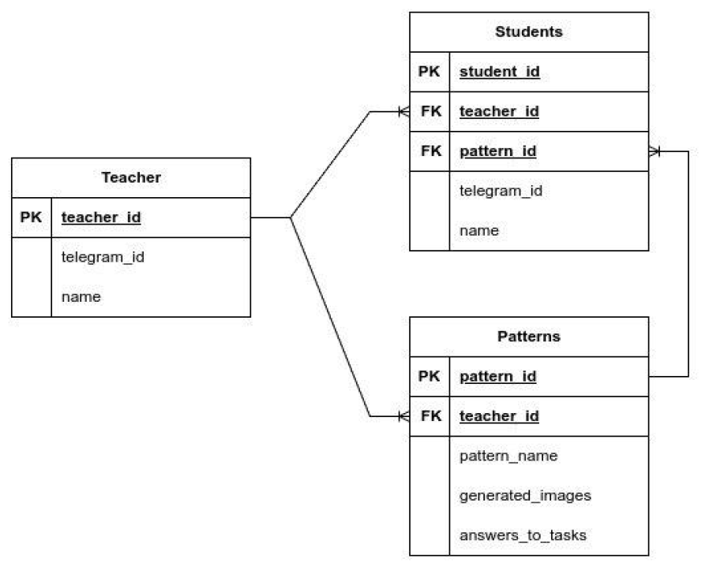
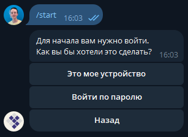
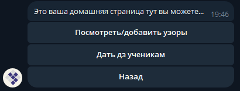
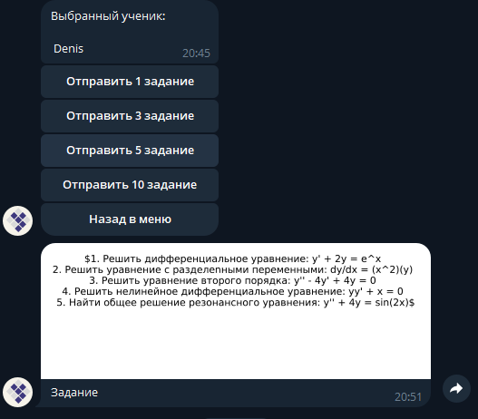

---
# MathBot


## Краткое описание проекта

В рамках хакатона "AI-powered от бизнес-инкубатора МГУ" для заказчика http://hodmatematika.ru команда сделала телеграм-бота, в который можно добавлять необходимые "узоры" (математические темы).


## Установка и запуск проекта
### For start bot:

Run from root project directory:

```bash
python3 main.py
```

### For start working with DB:

1. Push vars to `.env` (example in `.env.example`)

2. Up PosgreSQL with Docker

```bash
make docker-db-up
```

3. Create all tables

```py
python -m database.create_all
```

4. Use services in directory `services`

    For test, you can run code to add new teacher and work with him:

    ```py
    python -m services.tests
    ```

### Docker commands

In Makefile (for Linux)

```bash
make <command>
```

Для запуска БД postgreSQL в Docker:
```bash
make docker-db-up
```


## Основной функционал проекта

Telegram-бот, в котором можно добавлять необходимые "узоры" (математические темы). Для генерации и перепроверки использовали локально запущенный `deepseek`, вывод из которого конвертировался в png-картинки с `LaTeX`-формулами и склеивался в одну картинку для удобной отправки ученику. Все картинки сохранаются на сервере, а также в БД содержится информация о созданных картинках и учениках, закреплённых за каждым учителем. При необходимости можно сразу посмотреть ответы для сгенерированных примеров. В качестве киллер-фичи добавили генерацию видео, в котором даются голосовые подсказки и объяснения по решению, это видео можно отправить ученику чтобы он мог к нему обратиться в случае затруднений.

## Технологии и инструменты

[](https://pypi.org/project/aiogram/) 


## Команда проекта

[Иванова Ксения]() - дизайнер, тим-лидер

[Калинкин Денис](https://github.com/Din18m) - backend-разработчик (тг-бот)

[Князев Иван](https://github.com/Ivan-Knyazev) - backend-разработчик (контроллер для БД, тг-бот)

[Чашин Михаил](https://github.com/vvvvtrt) - ML-разработчик

[Беспалов Вениамин](https://github.com/eureu) - DevOps-инженер

[Лисовская Анастасия](https://github.com/NLastya) - frontend-разработчик


## Архитектура и структура проекта

Структура проекта представлена ниже:
```
.
├── Dockerfile
├── Makefile
├── README.md
├── bot
│   ├── handlers
│   │   ├── start.py
│   │   ├── student.py
│   │   └── teacher.py
│   └── keyboards
│       ├── start.py
│       ├── student.py
│       └── teacher.py
├── config.py
├── database
│   ├── __init__.py
│   ├── create_all.py
│   ├── env.py
│   ├── models.py
│   └── session.py
├── db_requirements.txt
├── docker-compose.yaml
├── latex_experiment.py
├── main.py
├── ml
│   ├── __init__.py
│   ├── main_ml.py
│   ├── make_img.py
│   └── parsing.py
├── repositories
│   ├── __init__.py
│   ├── pattern.py
│   ├── student.py
│   ├── teacher.py
│   └── tests.py
├── requirements.txt
└── services
    ├── __init__.py
    ├── student.py
    ├── teacher.py
    └── tests.py
```

Схема БД



## Демонстрация работы проекта








## Итог

Таким образом, нами был разработан уникальный бот для автоматической генерации математических задач по определённой теме и выводе их в виде картинки, чего нет у аналогов. Также имееется возможность отправки заданий ученикам.

---
